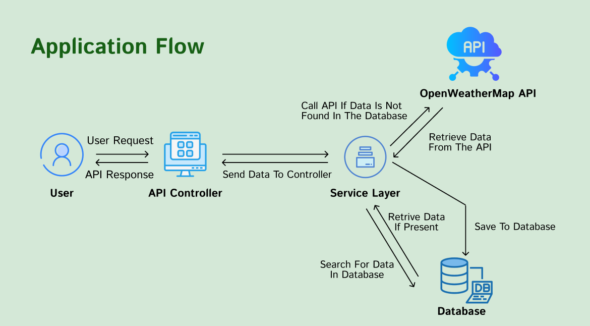

# Weather App Project
This project implements a Restful application using the
Spring Boot framework, which reads air pollution data based
on city name and date range and saves it to a database.
The public API from OpenWeatherMap is used for data retrieval.


### Setup Application
Enter your API key in application.properties
```
#environment variables
X-API-KEY = { your key }
```
Connect to frontend by entering the port number in WebConfig.java
```
.allowedOrigins("http://localhost:{ port number }")
```
### Endpoint 1 - Get City Coordinates
```
GET /api/location/{cityName}
```
http://localhost:8080/swagger-ui/index.html#/location-controller/getCityInformation
### Endpoint 2 - Get Current Pollution Data of Cities
```
GET /api/air-pollution/{cityName}
```
http://localhost:8080/swagger-ui/index.html#/air-pollution-controller/getPollutionInformation
### Endpoint 3 - Get Pollution Data of A Certain Period of Time
Date format: YYYY-MM-DD
```
GET /api/air-pollution/{cityName}/{startDate}/{endDate}
```
http://localhost:8080/swagger-ui/index.html#/air-pollution-controller/getPollutionInformation_1

### Documentation
http://localhost:8080/swagger-ui/index.html

#### Acknowledgements
[Elif Ece Can](https://github.com/eececan) - Initial Work